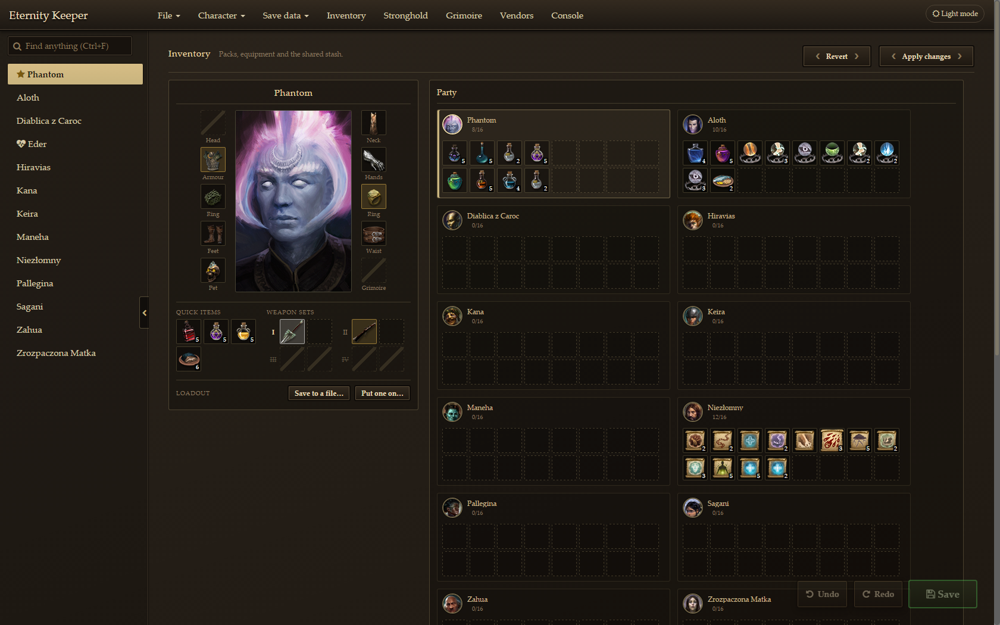
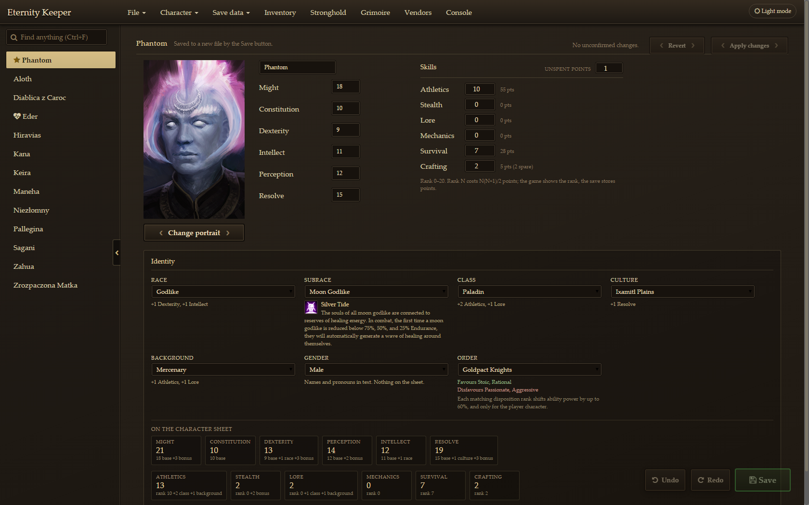
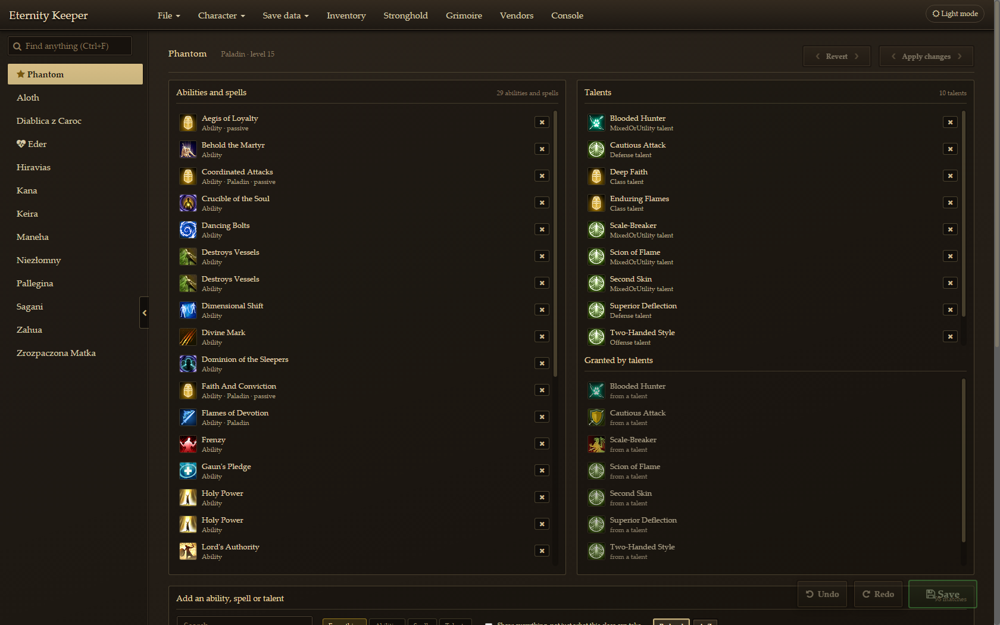
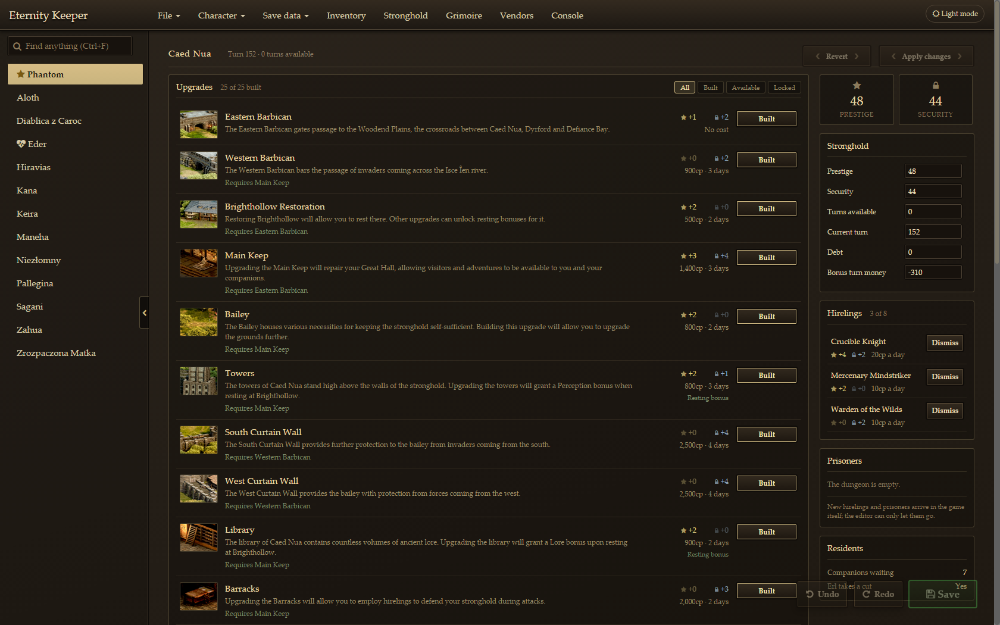

# Eternity Keeper

A save editor for **Pillars of Eternity**: characters, inventory, abilities,
grimoires, the stronghold, the party, and more. It works with the current
version of the game (tested with Steam v3.9.5).

Eternity Keeper was written by Kim Mantas in 2015 and 2016
([Bitbucket](https://bitbucket.org/Fyorl/eternity-keeper)). ktully added the
conversion of Windows Store saves (0.20a, 2020), and
[aybrkaknc](https://github.com/aybrkaknc/eternity-keeper) brought it up to the
current game, the turn-based patch included (0.21a, February 2026). This
version builds on that one: see [CHANGELOG.md](CHANGELOG.md) for everything
added since.

> Unofficial fan project, not affiliated with Obsidian Entertainment or Paradox
> Interactive. It contains no game files: item names, icons and other game data
> are read from your own installation.



| A character | Abilities and talents | The stronghold |
|---|---|---|
|  |  |  |

## Download and install (Windows)

From the [releases page](../../releases), take either of these. They hold the
same files.

- **`EternityKeeper-<version>-win64-setup.exe`**, the installer. It asks for no
  administrator rights: it installs for your user, under
  `%LOCALAPPDATA%\Programs\Eternity Keeper`, adds a Start menu entry, and is
  removed again from *Settings → Apps → Installed apps*. Running a newer
  version's installer upgrades the one that is there.
- **`EternityKeeper-<version>-win64.zip`**, with nothing installed: extract the
  whole zip anywhere, keeping every folder in it, and run `Eternity Keeper.exe`.

Nothing else is needed: both carry the Java 8 runtime and the embedded browser
the editor uses. It runs on 64-bit Windows 10 and 11.

Keep it in a folder whose path uses letters of your Windows' own language or
plain Latin ones (`C:\Games\Eternity Keeper` always works). The Java 8 runtime
cannot start from a folder named in another script, and the editor then says it
cannot find its `jre` folder; the installer checks this for you. Your user
name, saves folder and game folder can be in any script.

The downloads are not signed, so Windows may warn about an unrecognised app the
first time: choose **More info**, then **Run anyway**.

On first launch the editor finds your game and saves, then offers to read item
names and icons from your install (a few minutes, once). The game's own names
are shown in the language your game is set to; Settings has the choice. Its settings, its log
and the backups of your saves are kept in `%APPDATA%\Eternity Keeper` whichever
way you installed it, and uninstalling leaves that folder alone.

Windows is the supported platform for 1.0. Linux builds compile but are
untested; macOS has no build yet.

**Your saves are safe.** The editor never writes to the save you opened: Save
always writes a new save file, which the game lists beside the original. Before
it deletes or renames a save, or replaces one with the same name, it keeps a
copy; File → Backups puts any of the last ten back. Keep a backup of
`%USERPROFILE%\Saved Games\Pillars of Eternity` anyway until you have loaded an
edited save in the game.

## What it edits

- **Characters**: attributes, skills (as the ranks the game shows), experience,
  race, subrace, class, culture, background, deity and paladin order, with what
  each does to the character sheet; portraits from your install; names.
- **Inventory**: every party member's pack, equipment, quick slots, weapon
  sets and the shared stash, with real names and icons. Move, equip and unequip
  items under the game's own rules (slots, class, race, two-handed weapons,
  soulbound items, stack sizes); change stack sizes; add any item in the game;
  sell junk in bulk.
- **Abilities and talents** a character could learn, including the abilities a
  talent grants.
- **Grimoires**, four spells to a level, laid out like the game's spellbook.
- **The stronghold**: build and demolish upgrades with the game's own Prestige
  and Security arithmetic; dismiss hirelings and release prisoners; turns, debt
  and taxes.
- **The party**: swap companions with the stronghold roster from anywhere, and
  resurrect dead companions, including their failed quest.
- **Console**: re-enable achievements, and run the console commands a save can
  represent (experience, attributes, skills, money, globals, stronghold).
- Difficulty, Expert Mode, Trial of Iron, turn-based mode, and party money.
- Import and export characters as `.chr` files.
- Save what a character wears, holds and keeps to hand as a `.loadout` file,
  and put it on anyone, in this save or another playthrough, as copies.
- Undo and Redo for everything changed since the save was opened or saved.
- Convert a save for Steam and GOG builds older than the 2017 Unity update.

The **Raw** tab shows every stored number on a character. Most of them have
never been tested in the game; prefer the dedicated panels.

## Reporting a bug

Open an issue and attach `eternity.log`. It is in `%APPDATA%\Eternity Keeper`,
and Settings shows the exact path. Say what you did, what you expected and what
happened; the save itself helps most of all.

## Building from source

You need a **Java 8 JDK** and **Maven 3**. The embedded browser's natives are
Java 8 era, so a newer JDK builds but will not run the editor.

```bash
mvn install -Pwin64
run.bat
```

`-Pwin64` is required: the browser dependency is profile-scoped. `run.bat`
starts `target/eternity-keeper.jar` with a JDK 8 (it prefers
`..\tools\jdk8u492-b09` beside the checkout, else `java` on `PATH`) and keeps
settings and the log in the checkout rather than in `%APPDATA%`.

Useful system properties:

| Property | Effect |
|---|---|
| `-Dek.data=<folder>` | Where settings, the log and game data live |
| `-Dek.ui=<folder>` | Load the UI from this folder |
| `-Dek.debugPort=13002` | Open the embedded browser's DevTools port (the UI tests use it) |
| `-Dek.extractor=<program>` | The game-data reader to run (`.py` runs under Python) |

### Game data

`tools/gamedata/extract_gamedata.py` reads the item and ability catalogs,
progression tables, stronghold upgrades and deities out of a game install with
[UnityPy](https://github.com/K0lb3/UnityPy). The editor runs it itself (from a
checkout, under `python`), but it also works by hand:

```bash
pip install -r tools/gamedata/requirements.txt
python tools/gamedata/extract_gamedata.py --game "<install folder>" --out "<folder>"
```

See [tools/gamedata/README.md](tools/gamedata/README.md) for what it reads and why.

### Tests

```bash
mvn test -Pwin64
node src/test/js/SaveMergeTest.js
```

The scripted UI suites, which drive a running editor over the DevTools
protocol, are in [tools/ui-tests](tools/ui-tests/README.md).

### Making a release

```powershell
pwsh tools/release/build-release.ps1
```

Builds the jar and `Eternity Keeper.exe`, freezes the game-data reader with
PyInstaller, and zips them with a Java 8 runtime into
`target/release/EternityKeeper-<version>-win64.zip`. Where
[Inno Setup 6](https://jrsoftware.org/isinfo.php) is installed
(`winget install --id JRSoftware.InnoSetup -e`) it also builds the installer,
`EternityKeeper-<version>-win64-setup.exe`, out of the same folder
([tools/release/installer.iss](tools/release/installer.iss)).

```powershell
pwsh tools/release/test-installer.ps1 -Setup target/release/EternityKeeper-<version>-win64-setup.exe
```

installs it for the current user into a folder of its own, checks every part is
in place, starts the installed editor and waits for it to draw its page, then
uninstalls it and checks nothing is left but the data folder.

The `Package` workflow does both on GitHub's Windows runner, a machine with
none of the development setup on it: whenever the packaging changes, when run
by hand, and for a tag named `v*`, whose zip and installer it attaches to a
draft pre-release.

## Contributing

See [CONTRIBUTING.md](CONTRIBUTING.md). [ROADMAP.md](ROADMAP.md) has the plan.

## How the saves work

A `.savegame` is a heavily compressed zip: `MobileObjects.save` (the world
state), one `.lvl` file per visited area, `saveinfo.xml` and a screenshot. The
world state is serialized with the .NET library
[SharpSerializer](https://github.com/polenter/SharpSerializer), which
`uk.me.mantas.eternity.serializer` reimplements in Java; `TypeMap.java` maps
every C# type a save can hold. The game's saves are compressed harder than
default zip settings, so the files the editor writes are somewhat larger than
the game's own.

Every item ever sold to a vendor stays in the save, inside the `.lvl` files,
which is one reason saves grow as a game goes on.

[docs/](docs/README.md) has the notes kept while this was built: where each
thing lives in a save, what the game does with it when the save loads, the
rules an edit has to keep, and how each feature was checked in the game.

## Acknowledgements

The application icon is by
[Alexander Loginov](http://alexanderloginov.deviantart.com/). Contributors are
listed in [CONTRIBUTORS](CONTRIBUTORS), third-party software in
[THIRD-PARTY-NOTICES.md](THIRD-PARTY-NOTICES.md).

## License

GNU General Public License v3 or later. See [LICENSE](LICENSE).
